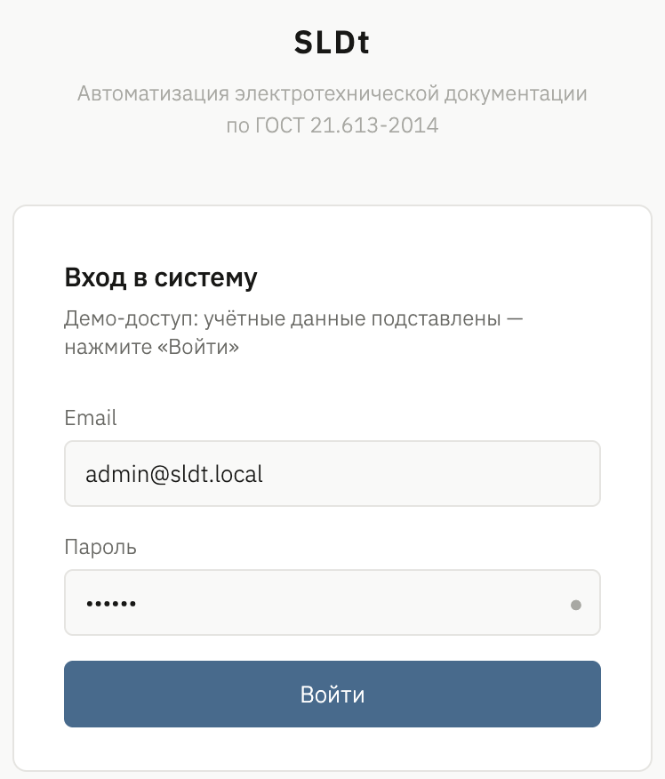
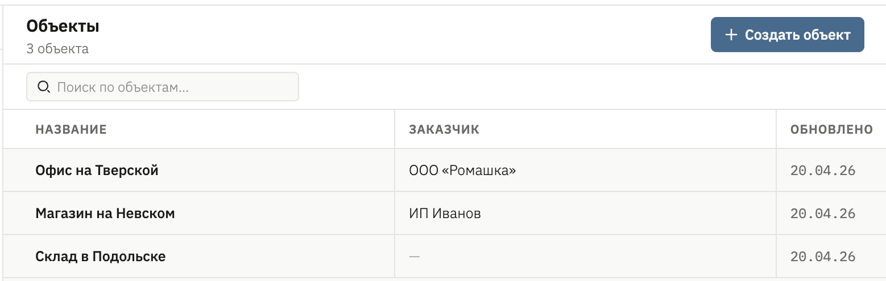
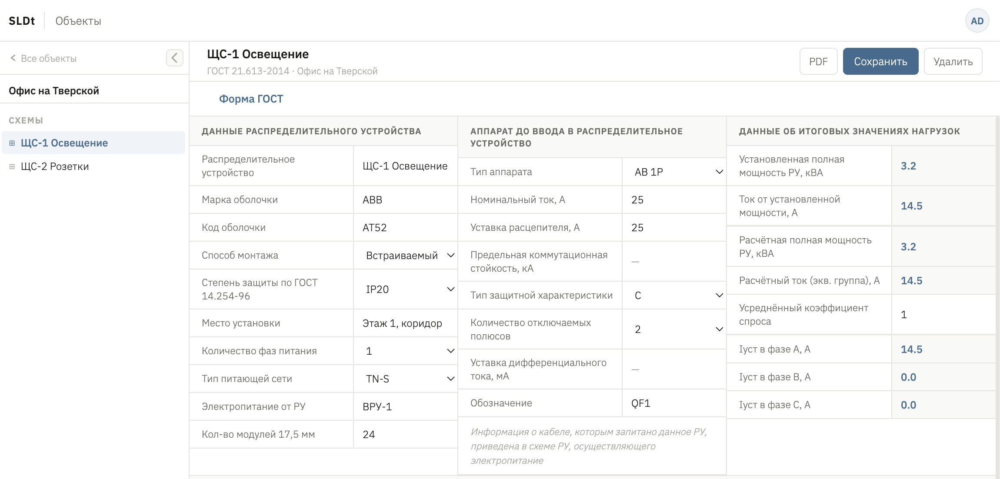
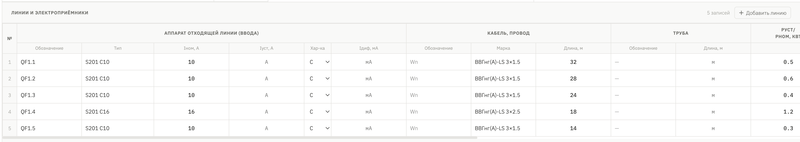
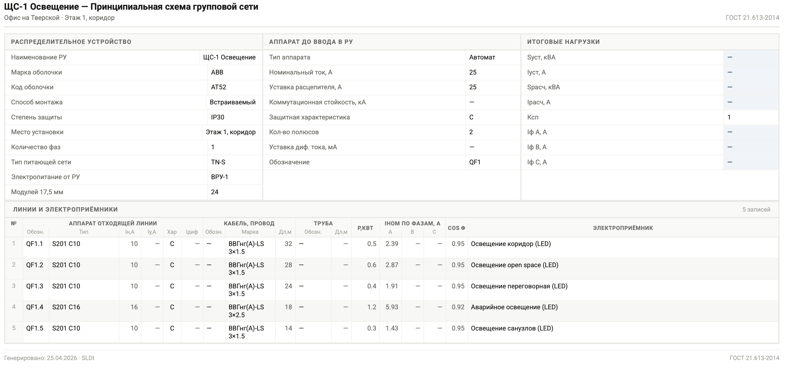

# SLDt-next

A web application for preparing low-voltage electrical distribution-board documentation in compliance with **GOST 21.613-2014** . SLDt-next replaces hand-filled spreadsheets and Word templates with a structured editor: data is captured in a typed schema, validated, used for electrical load calculations, and exported to a GOST-formatted PDF.

## Screenshots

| | |
| --- | --- |
|  |  |
| **Login** — email/password sign-in backed by Supabase Auth. | **Dashboard** — projects list with create/edit/delete actions. |
|  |  |
| **Scheme header** — GOST title block: distribution unit, input apparatus, computed totals. | **Outgoing-lines table** — inline editor for columns A–O on TanStack Table. |
|  | |
| **PDF export** — GOST-formatted document streamed from `/api/pdf/[schemeId]`. | |

> Drop screenshots as PNGs into `docs/screenshots/` using the filenames above and they will render here automatically.

## About

Designing a low-voltage distribution board normally produces a single-line diagram and an accompanying outgoing-lines table — both of which are traditionally laid out by hand in Word/Excel and re-typed for every project. This is slow, error-prone, and the data cannot be reused for analysis.

SLDt-next models the same documents as data:

- A **project** owns one or more schemes (boards).
- A **scheme** stores the GOST title block — the distribution-board (РУ) description, the input device, and the totals (Sуст, Iрасч, per-phase currents).
- A **scheme line** stores one outgoing line: circuit breaker, cable, conduit, installed power, per-phase currents, cosφ, and the connected load.

Because everything is structured, the same source can drive a GOST-formatted PDF, a load-analysis view, and equipment search across projects.

The intended users are electrical designers preparing project documentation under GOST 21.613-2014.

## Features

- **Projects.** Full CRUD for engineering projects (name, customer, owner).
- **Scheme editor.** GOST-compliant header form covering all three groups of the title block — distribution unit (shell, mounting, IP, network type, modules), input apparatus (type, In, trip setting, breaking capacity, characteristic, poles, ΔIΔn, designation, supply cable), and computed totals (Sуст, Iуст, Sрасч, Iрасч, Ксп, IA/IB/IC).
- **Outgoing-lines table (columns A–O).** Inline editor for the 15-column GOST table: breaker (designation, type, In, trip, characteristic, ΔIΔn), cable (designation, brand, length), conduit (designation, length, marking), power (kW), per-phase currents (IA/IB/IC), cos φ, and load (name, type, drawing reference). Built on TanStack Table.
- **Electrical calculations engine.** Pure-function library implementing the standard formulas:
  - 3-phase: `I = P / (√3 · 0.38 · cos φ)`
  - 1-phase: `I = P / (0.22 · cos φ)`
  - Apparent power: `S = P / cos φ`
  - Calculated load: `Pрасч = Pуст · Ксп`
  Covered by Vitest unit tests in `src/lib/calculations`.
- **PDF generation.** GOST-formatted single-line + table export rendered with `@react-pdf/renderer`, served via a streaming API route (`/api/pdf/[schemeId]`).
- **Authentication & data layer.** Email/password auth and persistence on Supabase (PostgreSQL + Auth) with row-level security. Mutations go through Next.js Server Actions in `src/app/actions/*`; reads use typed query helpers in `src/lib/supabase/queries/*`. Schema lives in `supabase/migrations/`.
- **Load-analysis panel.** Aggregated view of installed and calculated loads across a scheme.

## Tech stack

| Layer       | Technology                                                       |
| ----------- | ---------------------------------------------------------------- |
| Framework   | Next.js 16 (App Router), React 19, TypeScript 5                  |
| Styling     | Tailwind CSS v4, Shadcn UI on top of Radix primitives            |
| Forms       | React Hook Form + Zod (via `@hookform/resolvers`)                |
| Tables      | TanStack Table v8 (`@tanstack/react-table`)                      |
| PDF         | `@react-pdf/renderer`                                            |
| UX          | `next-themes`, `sonner` (toasts), `lucide-react` (icons)         |
| Backend     | Supabase (PostgreSQL + Auth) via `@supabase/ssr`, Next.js Server Actions     |
| Tooling     | ESLint 9 (`eslint-config-next`), Prettier + `prettier-plugin-tailwindcss`, Vitest |

Architectural conventions: Feature-Sliced Design folder layout, server components by default, SOLID/DRY, no `any`.

## Project structure

```
sldt-next/
├── src/
│   ├── app/
│   │   ├── (auth)/login/                ← public auth routes
│   │   ├── actions/                     ← Server Actions (auth, projects, schemes, lines, user)
│   │   ├── api/pdf/[schemeId]/          ← streaming PDF endpoint
│   │   ├── dashboard/
│   │   └── projects/[projectId]/
│   │       └── schemes/[schemeId]/      ← scheme editor route
│   ├── components/
│   │   ├── ui/                          ← Shadcn UI primitives
│   │   ├── layout/                      ← Sidebar, Topbar, UserMenu, settings
│   │   ├── auth/                        ← LoginForm
│   │   ├── projects/                    ← ProjectsView, ProjectFormDialog
│   │   ├── scheme/                      ← SchemeEditor, header form, lines table
│   │   └── pdf/                         ← SchemePdf (@react-pdf/renderer)
│   ├── lib/
│   │   ├── calculations/                ← electrical formulas + Vitest specs
│   │   ├── supabase/                    ← client.ts, server.ts, queries/*
│   │   ├── validations/                 ← Zod schemas
│   │   └── utils.ts
│   └── types/                           ← domain.ts, database.ts, enums.ts
├── supabase/migrations/                 ← SQL schema + RLS policies
├── references/                          ← UI references (GOST templates, mockups)
└── package.json
```

## Getting started

Requirements: Node.js 20+, npm, and a Supabase project (cloud or local via `supabase` CLI).

1. Install dependencies:
   ```bash
   npm install
   ```
2. Configure environment variables in `.env.local`:
   ```
   NEXT_PUBLIC_SUPABASE_URL=...
   NEXT_PUBLIC_SUPABASE_ANON_KEY=...
   ```
3. Apply the schema from `supabase/migrations/` to your Supabase instance.
4. Start the dev server:
   ```bash
   npm run dev
   ```

Open [http://localhost:3000](http://localhost:3000) and sign in.

## Scripts

| Command         | Purpose                              |
| --------------- | ------------------------------------ |
| `npm run dev`   | Start the Next.js dev server         |
| `npm run build` | Production build                     |
| `npm start`     | Run the production build             |
| `npm run lint`  | ESLint                               |
| `npm test`      | Vitest unit tests                    |


## Status

Active development. Chunks 0–9 (bootstrap, types, Supabase schema + RLS, Supabase client and queries, calculations engine, app shell and auth, projects CRUD, scheme editor, PDF export) are implemented on `main`.
